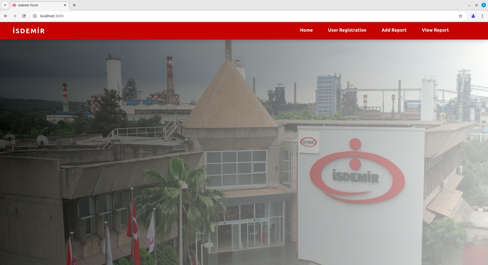
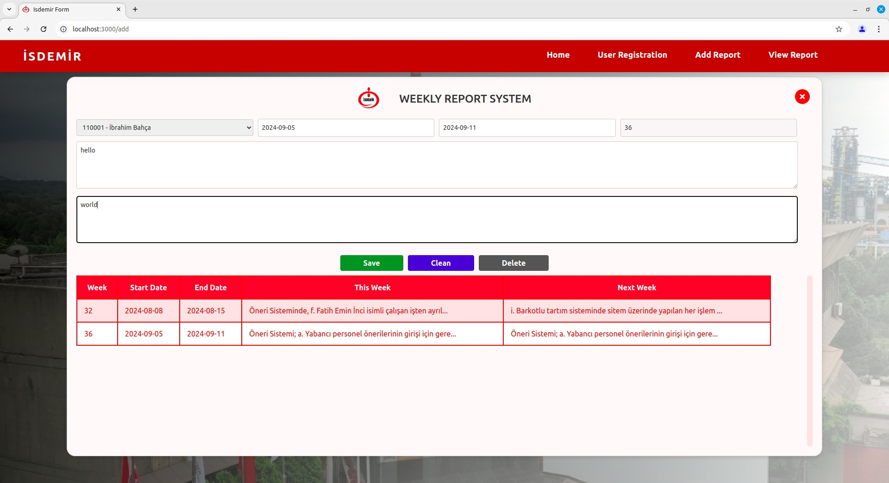
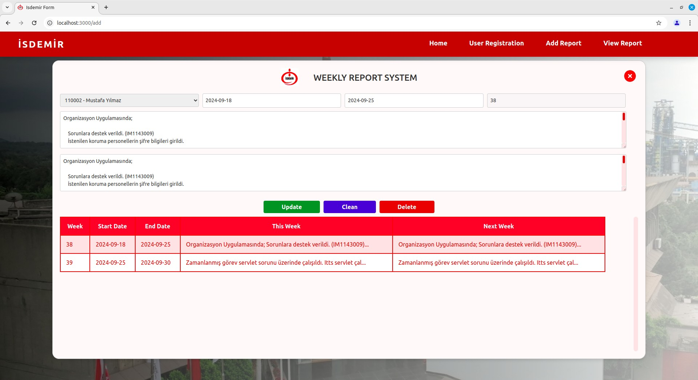
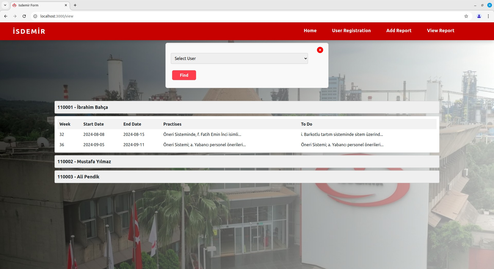
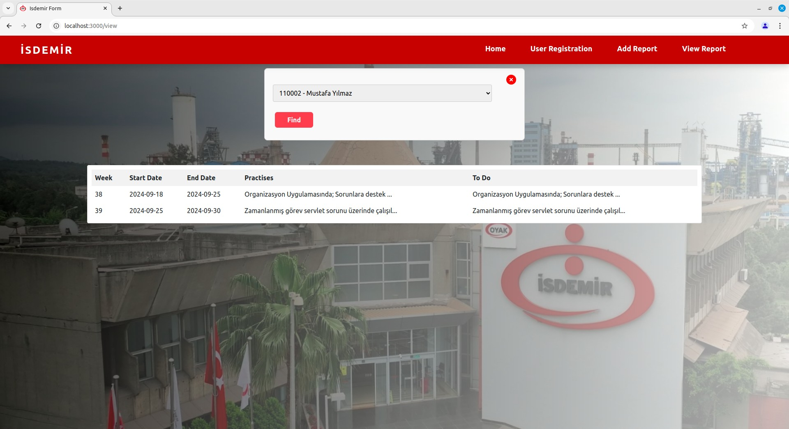
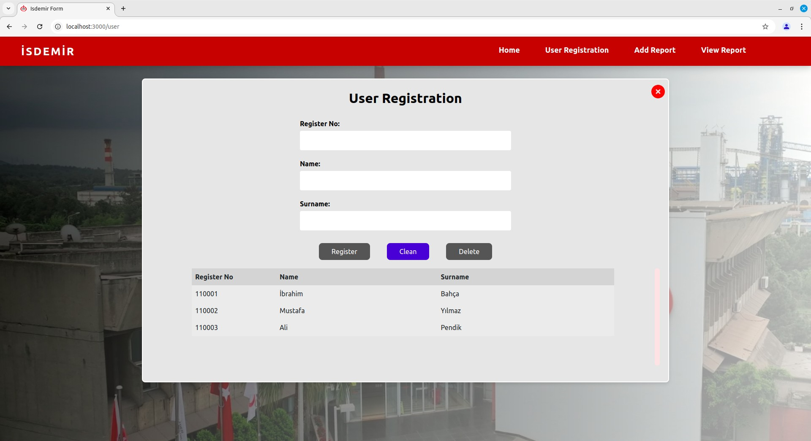
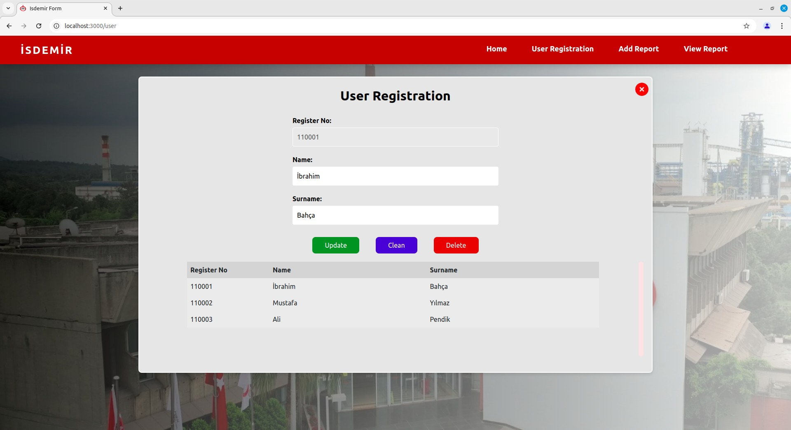

# Report Management System

This project is a full-stack web application developed as part of an internship to manage weekly team reports. It allows users to register, submit reports, and view submitted data in an organized and user-friendly manner.

## 🔧 Technologies Used

- **React** (Frontend):  
  Used to build a dynamic and responsive single-page user interface.
- **Spring Boot (Java)** (Backend):  
  Handles REST API creation, business logic, and database interaction.

- **MySQL** (Database):  
  Used to persist user and report data in a structured relational format.

- **Node.js**:  
  Utilized for supporting tools, build processes, or potential real-time extensions.

---

## 🚀 Features

### 🏠 Home Page

- A simple landing page that serves as a navigation hub for the rest of the application.

### ➕ Add Report Page

- Users can fill out a form including:
  - Register Number
  - Name and Surname (auto-filled)
  - Start and End Date
  - Week of Year
  - Weekly Practices and Next Week's To-Do
- Supports **create, update, and delete** operations.
- Automatically disables and enables buttons based on form validity.
- Prevents duplicate week entries and invalid date selections.

### 📄 View Reports Page

- Dropdown menu for selecting users.
- Collapsible and expandable user report sections.
- Pop-up modal for displaying long report entries (Practices & To-Do).
- Uses intuitive layout and color scheme for user-friendly viewing.

### 🧑‍💼 User Registration Page

- Register new users with:
  - Register Number
  - Name and Surname
- Users can be updated or deleted directly from the UI.
- Auto-completes user information based on Register Number input.
- Prevents duplicate entries and disables the register number in update mode.

---

## 📷 Screenshots

**Home Page**

**Add Report Page**

**View Reports Page**

**User Registration Page**

---

## 📝 How to Use

1. **Start the backend** using Spring Boot.
2. **Run the frontend** using `npm start` in the React project directory.
3. Register a user.
4. Add a report for that user.
5. View or update the report via the View Reports page.

---

## 📈 Future Improvements

- User authentication and authorization.
- Export reports as PDF or Excel.
- Weekly email summaries.
- Real-time collaboration features.

---

## 🧠 What I Learned

Through this project, I gained hands-on experience in:

- Connecting frontend and backend systems.
- Designing intuitive user interfaces.
- Implementing CRUD operations with data validation.
- Resolving circular dependencies in Spring Boot.
- Working with REST APIs and SQL databases in real-world scenarios.

---
